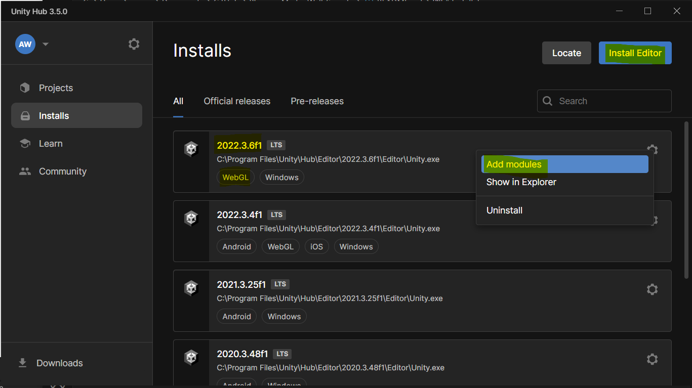
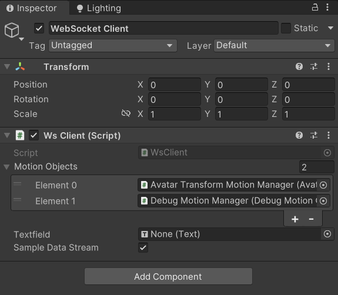
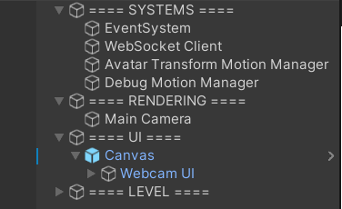
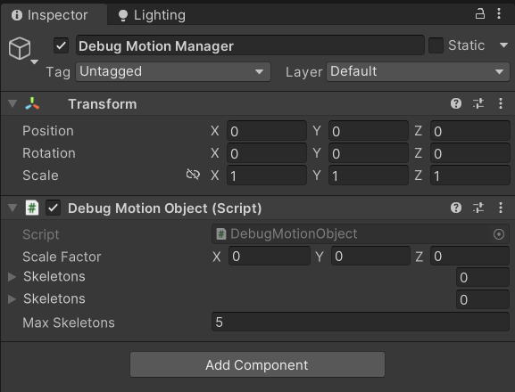

# Introduction

This project is designed to assist artists with creating content for the media wall at Phoenix Cinema and Arts Centre, Leicester, UK. They are split into two sections, the Unity 2022(LTS) Sample, and the Unity 2022(LTS) Template. You can find the documentation for the Javascript web sample here: https://github.com/PhoenixDigiArt/media-wall-webapp-sample.

In this repository, there are two options for your project, the Media-Wall Sample source code and the Media Wall Package (Found in the GitHub repository Releases page), and as the name suggests, the sample includes sample scenes with custom code. In contrast, the package installs the required functionality into your own project.

This document should be used as a guide on using the Media-Wall plugin for Unity, which can be downloaded as a Unity Package file from the repository releases page. To learn about Unity, please refer to the Unity Learn and Unity Documentation web pages for guidance.

### Recommendations

The Phoenix-Media-Wall package was built for Unity version 2022(LTS) and it is recommended that you use this version. All other Unity versions are untested and there may be unexpected errors with no documented solutions if you choose to use a different Unity build.

The bodytracking in this sample expects the 3D model used to have a humanoid skeleton. https://www.mixamo.com/ is an excellent resource for downloading pre-rigged models for free, and it also has a tool for automated rigging.

# Installation

To install this package, it is necessary to install WebGL support to your Unity installation. Either Install Unity2022(LTS) with the WebGL module in the Unity Hub launcher, or update your current installation of Unity2022(LTS) to include the WebGL module.

If you are using Unity 2022, but the subversion isn't 2022.3.6f1, they you will still be prompted before launching about whether you want to change the project version. This is okay, as long as you are using a 2022(LTS) version it should work. LTS means Long-Term support, so the version receives regular bug fixes that shouldn't effect the package.

### Dependancies

The Unity Project depends on the Native Websocket API package by Endal on GitHub, this package can be added to your project using the Unity Package Manager. Open the Package Manager window, Press the + in the upper left and click and from Git URL. The URL is: https://github.com/endel/NativeWebSocket.git#upm

### Adding the Media Wall Package to your project

Visit the releases page on the GitHub repository and download the latest stable release. Open your Unity 2022(LTS) project (or create a new one), and then drag the package into the Project window. You will then be asked to import all of the contents. Once imported, all the necessary scripts will be in your project, however you may have to manually add Native Web Sockets by Endel, which can be done by following the prior instructions.

### Opening the Media Wall Sample

Either use Git to clone the repository or download the source code from the Github page. Once downloaded, open Unity Hub and open the Media-Wall Sample project in Unity2022(LTS) with WebGL support.

### Creating a bodytracking scene

# Quick-Start Guide

#### Debug Skeletons

The debug motion object class in this package creates simple gameobjects to represent the bodytracking data. Once added to the Websocket Client Motion Objects array, the Debug Motion Object class will instantiate each skeleton in the bodytracking data. This is useful as a comparison tool to ensure that the bodytracking data is being accurately represented. (Tip: Rendering your character as 50% transparent in the material properties allows you to see the debug skeleton joints when they render inside the character body)

#### AvatarIK skeleton

#### AvatarTransform Skeleton

#### Webcam Passthrough

To add the webcam footage to your scene, either as a fullscreen UI element or as a 3d object in the world space, either drag either the Canvas or Object prefabs from Assets/Prefabs/Webcam, or Create an object with either a renderer or a UI raw image and attach the Webcam Controller script.

### Building for web
